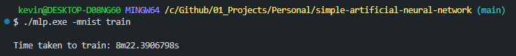
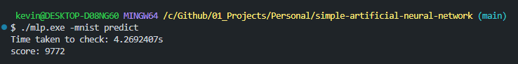
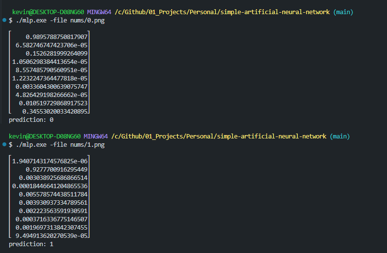

# Simple Artificial Neural Network

This project implements a simple artificial neural network for training and predicting the MNIST dataset. The neural network is built using Go and the Gonum package for matrix operations.

## Table of Contents

- [Introduction](#introduction)
- [Features](#features)
- [Installation](#installation)
- [Usage](#usage)
  - [Training](#training)
  - [Prediction](#prediction)
  - [Predicting Individual Files](#predicting-individual-files)

## Introduction

The goal of this project is to create a simple neural network from scratch to understand the basics of neural networks and their training process. The project uses the MNIST dataset, which is a large database of handwritten digits commonly used for training various image processing systems.

## Features

- Train the neural network using the MNIST training dataset
- Predict digits using the trained neural network
- Save and load network weights

## Installation

To set up this project locally, follow these steps:

1. **Clone the repository:**
    ```sh
    git clone https://github.com/kevin-collinss/simple-artificial-neural-network.git
    cd simple-artificial-neural-network
    ```

2. **Install Go:**
   Make sure you have Go installed. You can download and install it from [the official Go website](https://golang.org/dl/).

3. **Install Gonum:**
    ```sh
    go get -u gonum.org/v1/gonum/...
    ```

4. **Build the project:**
    ```sh
    go build -o mlp.exe
    ```

## Usage

### Training

To train the neural network using the MNIST dataset, use the following command:

```sh
./mlp.exe -mnist train
```

Ensure you have the MNIST training data unzipped in the in the `mnist_dataset` directory.

## Prediction

To predict using the trained neural network, use the following command:

```sh
./mlp.exe -mnist predict
```


## Predicting Individual Files
```sh
./mlp.exe -file nums/7.png
```

